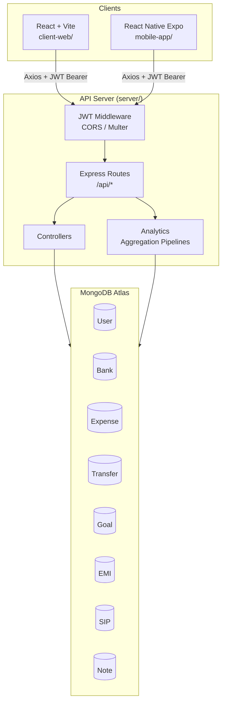

# Design Document: MoneyFlowX Platform

## Overview

MoneyFlowX is a full-stack fintech finance management platform with a shared Node.js/Express backend serving both a React + Vite web app and a React Native Expo mobile app. The current codebase is a single-page React app using localStorage and Context API for state — this design describes the migration to a real backend with MongoDB Atlas, JWT authentication, and a proper REST API, while preserving the existing UI patterns and CSS design system.

The architecture follows a classic three-tier model: React/React Native clients communicate with an Express REST API over HTTPS, which reads and writes to MongoDB Atlas. Both clients share the same API surface, differing only in navigation structure and storage mechanisms.

---

## Architecture



### Key Architectural Decisions

- Single shared backend for web and mobile — no duplication of business logic
- Stateless JWT authentication — no server-side sessions, scales horizontally
- MongoDB document model — flexible schema suits the varied financial record types
- Balance mutations are synchronous within the same request — no eventual consistency issues for fund transfers and expense deductions
- File uploads stored on the server filesystem under `server/uploads/` — a CDN or S3 can replace this in production without API changes
- The web app uses a sidebar layout on desktop and the existing bottom nav on mobile viewports; the React Native app uses a dedicated bottom tab navigator

---

## Components and Interfaces

### Backend (`server/`)

```
server/
├── config/
│   └── db.js               # Mongoose connection
├── controllers/
│   ├── authController.js
│   ├── bankController.js
│   ├── expenseController.js
│   ├── transferController.js
│   ├── goalController.js
│   ├── emiController.js
│   ├── sipController.js
│   ├── noteController.js
│   └── analyticsController.js
├── middleware/
│   ├── auth.js             # JWT verification
│   ├── upload.js           # Multer config
│   └── errorHandler.js     # Global error handler
├── models/
│   ├── User.js
│   ├── Bank.js
│   ├── Expense.js
│   ├── Transfer.js
│   ├── Goal.js
│   ├── EMI.js
│   ├── SIP.js
│   └── Note.js
├── routes/
│   ├── auth.js
│   ├── banks.js
│   ├── expenses.js
│   ├── transfers.js
│   ├── goals.js
│   ├── emi.js
│   ├── sip.js
│   ├── notes.js
│   └── analytics.js
├── uploads/                # Multer file storage
└── server.js
```

#### REST API Endpoints

| Method | Path | Auth | Description |
|--------|------|------|-------------|
| POST | /api/auth/register | No | Register new user |
| POST | /api/auth/login | No | Login, returns JWT |
| GET | /api/auth/me | Yes | Get current user profile |
| PUT | /api/auth/profile | Yes | Update profile (name, salary, currency) |
| POST | /api/auth/profile/picture | Yes | Upload profile picture (multipart) |
| GET | /api/banks | Yes | List user's banks |
| POST | /api/banks | Yes | Create bank |
| PUT | /api/banks/:id | Yes | Update bank |
| DELETE | /api/banks/:id | Yes | Delete bank |
| GET | /api/expenses | Yes | List expenses (query: type, category, month) |
| POST | /api/expenses | Yes | Create expense + deduct bank balance |
| DELETE | /api/expenses/:id | Yes | Delete expense + restore bank balance |
| GET | /api/transfers | Yes | List transfers |
| POST | /api/transfers | Yes | Create transfer + update both bank balances |
| DELETE | /api/transfers/:id | Yes | Delete transfer + reverse bank balances |
| GET | /api/goals | Yes | List goals |
| POST | /api/goals | Yes | Create goal |
| PUT | /api/goals/:id | Yes | Update goal (contribution or edit) |
| DELETE | /api/goals/:id | Yes | Delete goal |
| GET | /api/emi | Yes | List EMIs |
| POST | /api/emi | Yes | Create EMI |
| POST | /api/emi/:id/payment | Yes | Record EMI payment |
| DELETE | /api/emi/:id | Yes | Delete EMI |
| GET | /api/sip | Yes | List SIPs |
| POST | /api/sip | Yes | Create SIP |
| POST | /api/sip/:id/contribution | Yes | Record SIP contribution |
| DELETE | /api/sip/:id | Yes | Delete SIP |
| GET | /api/notes | Yes | List notes |
| POST | /api/notes | Yes | Create note |
| PUT | /api/notes/:id | Yes | Update note |
| DELETE | /api/notes/:id | Yes | Delete note |
| GET | /api/analytics/summary | Yes | Dashboard summary metrics |
| GET | /api/analytics/expenses | Yes | Expense breakdown by category + monthly |

#### JWT Middleware (`middleware/auth.js`)

```js
// Extracts Bearer token, verifies with JWT_SECRET, attaches req.user = { id }
// Returns 401 if token is missing, malformed, or expired
```

#### Multer Config (`middleware/upload.js`)

```js
// diskStorage: destination = server/uploads/, filename = Date.now() + originalname
// fileFilter: accept image/jpeg, image/png, image/webp only
// limits: fileSize = 5MB
// Exported as: uploadSingle (single file field 'image')
```

### Web Frontend (`client-web/`)

```
client-web/
├── src/
│   ├── services/
│   │   └── api.js          # Axios instance + interceptors
│   ├── context/
│   │   ├── AuthContext.jsx  # JWT, currentUser, login/logout
│   │   └── ThemeContext.jsx # dark/light toggle + localStorage
│   ├── components/
│   │   ├── Topbar.jsx       # Logo, theme toggle, profile dropdown
│   │   ├── Sidebar.jsx      # Desktop nav links
│   │   ├── BottomNav.jsx    # Mobile bottom tabs (existing)
│   │   └── ProtectedRoute.jsx
│   ├── pages/
│   │   ├── Login.jsx
│   │   ├── Register.jsx
│   │   ├── Dashboard.jsx
│   │   ├── Banks.jsx
│   │   ├── Expenses.jsx
│   │   ├── Transfers.jsx
│   │   ├── Goals.jsx
│   │   ├── EMI.jsx
│   │   ├── SIP.jsx
│   │   ├── Notes.jsx
│   │   ├── Analytics.jsx
│   │   └── More.jsx
│   ├── styles/
│   │   └── global.css       # Existing design system (preserved)
│   ├── App.jsx
│   └── main.jsx
├── .env                     # VITE_API_URL=
└── vite.config.js
```

#### API Service (`services/api.js`)

```js
// Axios instance with baseURL = import.meta.env.VITE_API_URL
// Request interceptor: attach Authorization: Bearer <token> from localStorage
// Response interceptor: on 401, clear token and redirect to /login
```

#### Context Split

The existing monolithic `FinanceContext` is split into two focused contexts:

- `AuthContext` — manages `currentUser`, `token`, `login()`, `logout()`, `register()`; persists JWT to `localStorage`
- `ThemeContext` — manages `theme`, `toggleTheme()`; persists to `localStorage`

All data fetching (banks, expenses, etc.) moves from context state into per-page `useEffect` + `useState` calls against the API, eliminating the need to hold all user data in memory at once.

### Mobile App (`mobile-app/`)

```
mobile-app/
├── screens/
│   ├── LoginScreen.jsx
│   ├── RegisterScreen.jsx
│   ├── HomeScreen.jsx
│   ├── ExpensesScreen.jsx
│   ├── BanksScreen.jsx
│   ├── TransfersScreen.jsx
│   ├── GoalsScreen.jsx
│   ├── EMIScreen.jsx
│   ├── SIPScreen.jsx
│   ├── NotesScreen.jsx
│   ├── AnalyticsScreen.jsx
│   └── MoreScreen.jsx
├── navigation/
│   ├── AppNavigator.jsx    # Root stack: Auth vs Main
│   ├── BottomTabNavigator.jsx
│   └── MoreStack.jsx
├── context/
│   ├── AuthContext.jsx     # Same logic as web, uses SecureStore
│   └── ThemeContext.jsx
├── services/
│   └── api.js              # Same Axios setup, baseURL from app.config.js
├── components/
│   └── (shared UI primitives)
└── app.config.js           # EXPO_PUBLIC_API_URL
```

#### Navigation Structure

```
AppNavigator (Stack)
├── AuthStack (when no token)
│   ├── LoginScreen
│   └── RegisterScreen
└── MainTabs (BottomTabNavigator, when token present)
    ├── Home tab → HomeScreen
    ├── Expenses tab → ExpensesScreen
    ├── Banks tab → BanksScreen
    ├── Transfers tab → TransfersScreen
    └── More tab → MoreScreen
        (MoreScreen links to Goals, EMI, SIP, Notes, Analytics, Logout)
```

---

## Data Models

### User

```js
{
  _id: ObjectId,
  name: String (required),
  email: String (required, unique, lowercase),
  password: String (required, bcrypt hashed),
  profilePicture: String (file path, default null),
  monthlySalary: Number (default 0),
  currency: String (default 'INR'),
  createdAt: Date
}
```

### Bank

```js
{
  _id: ObjectId,
  user: ObjectId (ref: User, required),
  name: String (required),
  purpose: String (enum: Salary|Daily|Savings|SIP|EMI|Investment, required),
  balance: Number (required, default 0),
  createdAt: Date
}
```

### Expense

```js
{
  _id: ObjectId,
  user: ObjectId (ref: User, required),
  bank: ObjectId (ref: Bank, required),
  type: String (enum: Daily|Other, required),
  category: String (required),
  // Daily categories: Food, Fuel, Tea, Snacks, Transport
  // Other categories: Rent, Bills, Insurance, Hospital, Shopping, Travel
  amount: Number (required, min: 0.01),
  paymentMethod: String (enum: UPI|Cash|Card|Net Banking, required),
  notes: String,
  receiptImage: String (file path),
  date: Date (required, default: now),
  createdAt: Date
}
```

### Transfer

```js
{
  _id: ObjectId,
  user: ObjectId (ref: User, required),
  fromBank: ObjectId (ref: Bank, required),
  toBank: ObjectId (ref: Bank, required),
  amount: Number (required, min: 0.01),
  notes: String,
  date: Date (required, default: now),
  createdAt: Date
}
```

### Goal

```js
{
  _id: ObjectId,
  user: ObjectId (ref: User, required),
  name: String (required),
  targetAmount: Number (required, min: 1),
  savedAmount: Number (default: 0),
  targetDate: Date,
  isCompleted: Boolean (default: false),
  createdAt: Date
}
```

### EMI

```js
{
  _id: ObjectId,
  user: ObjectId (ref: User, required),
  bank: ObjectId (ref: Bank, required),
  loanName: String (required),
  totalAmount: Number (required),
  emiAmount: Number (required),
  dueDay: Number (required, 1-31),
  startDate: Date (required),
  endDate: Date (required),
  isFullyPaid: Boolean (default: false),
  payments: [{ amount: Number, date: Date, _id: false }],
  createdAt: Date
}
```

### SIP

```js
{
  _id: ObjectId,
  user: ObjectId (ref: User, required),
  bank: ObjectId (ref: Bank, required),
  fundName: String (required),
  monthlyAmount: Number (required),
  sipDay: Number (required, 1-31),
  startDate: Date (required),
  contributions: [{ amount: Number, date: Date, _id: false }],
  createdAt: Date
}
```

### Note

```js
{
  _id: ObjectId,
  user: ObjectId (ref: User, required),
  title: String (required),
  body: String,
  reminderDate: Date,
  createdAt: Date
}
```

---

## Correctness Properties

*A property is a characteristic or behavior that should hold true across all valid executions of a system — essentially, a formal statement about what the system should do. Properties serve as the bridge between human-readable specifications and machine-verifiable correctness guarantees.*

### Property 1: Password hashing round trip

*For any* registration request with a valid password, the stored User document's password field should not equal the plaintext password, and `bcrypt.compare(plaintext, stored)` should return true.

**Validates: Requirements 1.2**

---

### Property 2: Duplicate email rejection

*For any* two registration requests with the same email address, the second request should be rejected with a 409 status regardless of the name or password provided.

**Validates: Requirements 1.3**

---

### Property 3: JWT authentication round trip

*For any* valid login request, the returned JWT should decode to a payload containing the user's ID, and presenting that JWT on a protected endpoint should return a 200 response scoped to that user's data.

**Validates: Requirements 2.1, 3.5**

---

### Property 4: Expense deduction invariant

*For any* bank with balance B and any expense of amount A (where A > 0), after creating the expense the bank's balance should equal B − A.

**Validates: Requirements 6.2, 7.2, 19.1**

---

### Property 5: Expense deletion restores balance

*For any* expense that has been created (which deducted amount A from bank balance B), deleting that expense should restore the bank balance to B.

**Validates: Requirements 7.6, 19.3**

---

### Property 6: Transfer balance conservation

*For any* transfer of amount A from bank S (balance Bs) to bank D (balance Bd), after the transfer: S.balance = Bs − A and D.balance = Bd + A. The total balance across both banks is conserved.

**Validates: Requirements 8.1, 8.2, 19.2**

---

### Property 7: Transfer deletion reversal

*For any* transfer that has been created, deleting it should restore both the source and destination bank balances to their pre-transfer values.

**Validates: Requirements 8.7**

---

### Property 8: Goal completion invariant

*For any* goal where savedAmount >= targetAmount, the goal's isCompleted field should be true.

**Validates: Requirements 9.6**

---

### Property 9: EMI remaining balance calculation

*For any* EMI record, the remaining balance should equal totalAmount minus the sum of all payment amounts in the payments array.

**Validates: Requirements 10.5**

---

### Property 10: SIP total invested calculation

*For any* SIP record, the total invested amount should equal the sum of all contribution amounts in the contributions array.

**Validates: Requirements 11.5**

---

### Property 11: User data isolation

*For any* two distinct users U1 and U2, a request authenticated as U1 should never return documents owned by U2 from any endpoint.

**Validates: Requirements 19.5**

---

### Property 12: Analytics scope isolation

*For any* analytics query authenticated as user U, all aggregated data should be derived exclusively from documents where `user = U._id`.

**Validates: Requirements 14.6**

---

## Error Handling

### HTTP Status Code Conventions

| Scenario | Status |
|----------|--------|
| Successful read/update | 200 |
| Successful creation | 201 |
| Validation failure (missing/invalid fields) | 400 |
| Unauthenticated (missing/expired JWT) | 401 |
| Insufficient bank balance for transfer | 400 |
| Duplicate email on registration | 409 |
| Resource not found | 404 |
| Unhandled server error | 500 |

### Global Error Handler (`middleware/errorHandler.js`)

All controllers use `next(err)` to forward errors. The global handler:
- Logs the full error stack server-side
- Returns `{ message: "Internal server error" }` with status 500 to the client (no stack traces in responses)
- Handles Mongoose `ValidationError` → 400 with field-level messages
- Handles Mongoose `CastError` (invalid ObjectId) → 404

### Client-Side Error Handling

- Axios response interceptor catches 401 globally → clears token, redirects to login
- Per-request `try/catch` in page components displays inline error messages using the existing `.error-msg` CSS class
- Network errors surface a generic "Unable to connect" message

### Bank Deletion Guard

Before deleting a bank, the controller checks for any Expense, Transfer, EMI, or SIP documents referencing that bank. If any exist, it returns 400 with a message listing the dependent record counts. This prevents orphaned financial records.

---

## Testing Strategy

### Unit Tests

Focus on isolated business logic that doesn't require a running server or database:

- `authController`: password hashing, JWT generation, validation logic
- `bankController`: balance mutation helpers
- `analyticsController`: aggregation pipeline construction
- Goal completion check: `savedAmount >= targetAmount → isCompleted = true`
- EMI remaining balance calculation
- SIP total invested calculation

Use Jest with `mongodb-memory-server` for controller tests that need a real Mongoose connection without hitting Atlas.

### Property-Based Tests

Use **fast-check** (JavaScript) for property-based testing. Each test runs a minimum of 100 iterations.

Property tests are tagged with the format:
`// Feature: MoneyFlowX-platform, Property N: <property_text>`

**Property 1 — Password hashing round trip**
Generate arbitrary valid passwords (length ≥ 8). Register a user, then verify `bcrypt.compare(plaintext, user.password)` is true and `user.password !== plaintext`.
`// Feature: MoneyFlowX-platform, Property 1: password hashing round trip`

**Property 2 — Duplicate email rejection**
Generate arbitrary email strings. Register twice with the same email. Assert second response is 409.
`// Feature: MoneyFlowX-platform, Property 2: duplicate email rejection`

**Property 3 — JWT authentication round trip**
Generate arbitrary user credentials. Register, login, use returned JWT on `/api/auth/me`. Assert response contains the same user ID.
`// Feature: MoneyFlowX-platform, Property 3: JWT authentication round trip`

**Property 4 — Expense deduction invariant**
Generate arbitrary bank balance and expense amount (amount > 0, amount ≤ balance). Create expense, fetch bank. Assert `bank.balance === initialBalance - amount`.
`// Feature: MoneyFlowX-platform, Property 4: expense deduction invariant`

**Property 5 — Expense deletion restores balance**
Generate arbitrary bank and expense. Create expense (records balance B−A), delete expense, fetch bank. Assert `bank.balance === B`.
`// Feature: MoneyFlowX-platform, Property 5: expense deletion restores balance`

**Property 6 — Transfer balance conservation**
Generate arbitrary source balance Bs, destination balance Bd, and transfer amount A (0 < A ≤ Bs). Create transfer, fetch both banks. Assert `src.balance === Bs − A` and `dst.balance === Bd + A`.
`// Feature: MoneyFlowX-platform, Property 6: transfer balance conservation`

**Property 7 — Transfer deletion reversal**
Generate arbitrary transfer. Create it, delete it, fetch both banks. Assert balances match pre-transfer values.
`// Feature: MoneyFlowX-platform, Property 7: transfer deletion reversal`

**Property 8 — Goal completion invariant**
Generate arbitrary goals with `savedAmount >= targetAmount`. Assert `isCompleted === true` after save.
`// Feature: MoneyFlowX-platform, Property 8: goal completion invariant`

**Property 9 — EMI remaining balance calculation**
Generate arbitrary EMI with N payments. Assert `remainingBalance === totalAmount - sum(payments)`.
`// Feature: MoneyFlowX-platform, Property 9: EMI remaining balance calculation`

**Property 10 — SIP total invested calculation**
Generate arbitrary SIP with N contributions. Assert `totalInvested === sum(contributions)`.
`// Feature: MoneyFlowX-platform, Property 10: SIP total invested calculation`

**Property 11 — User data isolation**
Generate two users U1 and U2 with overlapping resource types. Assert all GET responses for U1 contain only documents with `user === U1._id`.
`// Feature: MoneyFlowX-platform, Property 11: user data isolation`

**Property 12 — Analytics scope isolation**
Generate two users with expenses. Assert analytics response for U1 sums only U1's expenses.
`// Feature: MoneyFlowX-platform, Property 12: analytics scope isolation`

### Integration / Example Tests

- Full auth flow: register → login → access protected route → logout → access protected route returns 401
- Insufficient balance transfer returns 400
- Bank deletion with dependent records returns 400
- File upload: POST with multipart form data stores file and returns path in response
- Note due-date highlighting: note with `reminderDate = today` is returned with a flag or the client filters by date
- Dashboard summary endpoint returns all required fields in a single response

### Frontend Tests

Use **Vitest** + **React Testing Library** for the web app:
- `ProtectedRoute` redirects unauthenticated users to `/login`
- Theme toggle switches `data-theme` attribute on `document.documentElement`
- Theme persists across page reload (localStorage mock)
- Currency symbol updates across all monetary displays when preference changes

